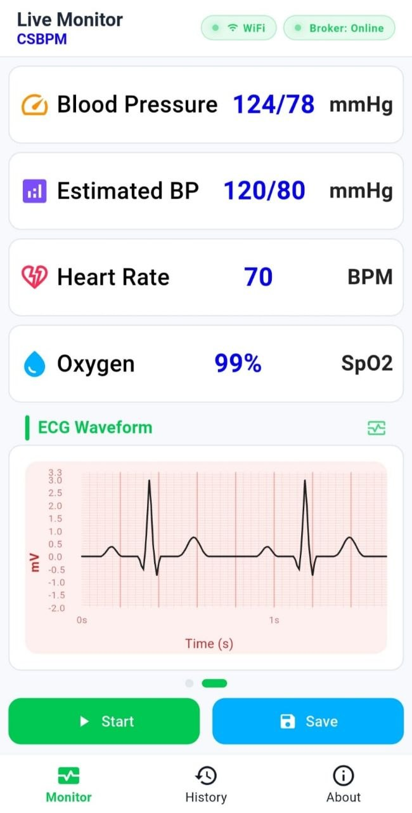
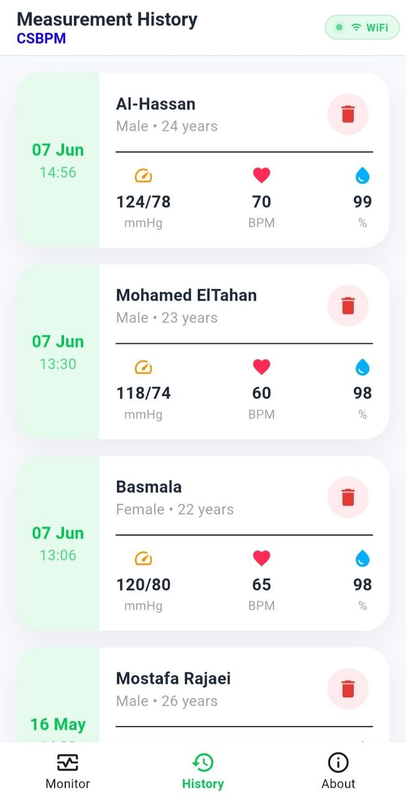
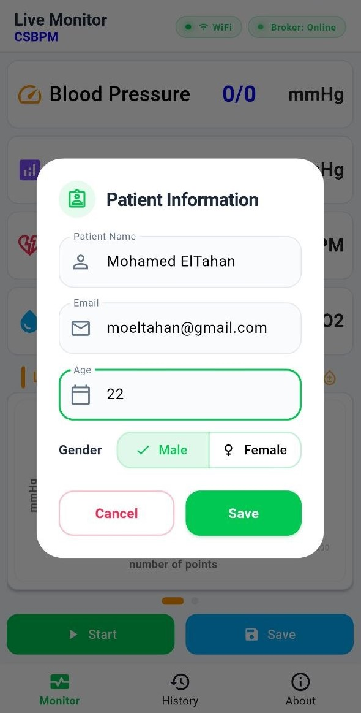
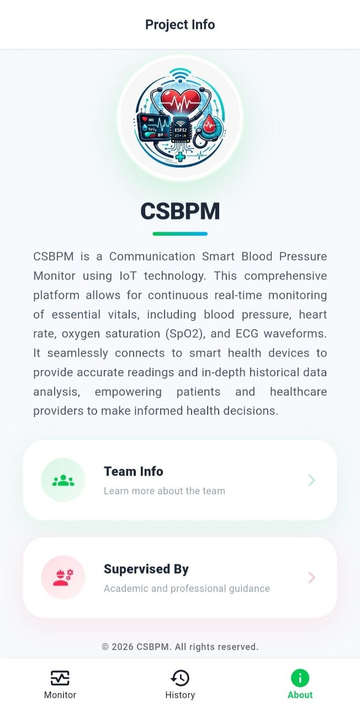

# 🩺 Design and Realization of Smart Blood Pressure Monitor with IoT (CSBPM)

<p align="center">
An intelligent healthcare monitoring platform integrating <b>Embedded Systems</b>, <b>Internet of Things (IoT)</b>, <b>Artificial Intelligence</b>, <b>Flutter</b>, and <b>Web Technologies</b> to enable real-time patient monitoring and remote healthcare communication.
</p>

<p align="center">


</p>

---

## 📖 Overview

**CSBPM (Communication Smart Blood Pressure Monitor)** is an intelligent healthcare monitoring system developed as a graduation project.

The project combines **Embedded Systems**, **Internet of Things (IoT)**, **Artificial Intelligence**, **Flutter Mobile Development**, **Web Development**, and **Cloud Computing** into a unified healthcare platform.

The system enables healthcare providers to remotely monitor patients by collecting physiological data from an ESP32-based smart device, transmitting it securely through MQTT, storing it in the cloud, and visualizing it through mobile and web applications.

---

## 🎯 Objectives

- Build a portable smart healthcare monitoring device.
- Enable continuous remote monitoring using IoT.
- Improve communication between patients and healthcare providers.
- Store and synchronize medical data securely in the cloud.
- Apply AI techniques to analyze physiological measurements.
- Develop user-friendly mobile and web applications.

---

## ✨ Features

### 📊 Health Monitoring

- Blood Pressure
- Estimated Blood Pressure
- ECG (Electrocardiograph)
- Heart Rate (HR)
- Blood Oxygen Saturation (SpO₂)

### 🌐 Internet of Things (IoT)

- Real-time data transmission
- MQTT communication
- Remote monitoring
- Live synchronization

### 📱 Flutter Mobile Application

- Live health monitoring
- Interactive ECG visualization
- Patient profile
- Measurement history
- Health statistics
- Notifications and alerts

### 💻 Web Application

- Healthcare dashboard
- Patient management
- Doctor portal
- Administrative dashboard
- Project presentation website

### 🤖 Artificial Intelligence

- Health data analysis
- Physiological trend analysis
- Intelligent health insights

### 🔒 Security

- Firebase Authentication
- Secure cloud storage
- Role-based access control
- Protected patient information

---

## 🏗 System Architecture

```text
                  +----------------------+
                  |     ESP32 Device     |
                  | BP • ECG • HR • SpO₂ |
                  +----------+-----------+
                             |
                         MQTT Broker
                             |
              +--------------+--------------+
              |                             |
      Flutter Mobile App            Web Dashboard
              |                             |
              +--------------+--------------+
                             |
                    Firebase Firestore
                             |
                     AI Health Analysis
```

---

## 📱 Mobile Application

The Flutter application enables users to:

- Monitor vital signs in real time.
- Display ECG waveform visualization.
- Review historical measurements.
- Receive alerts and notifications.
- Manage patient profile information.
- Access health statistics.

---

## 💻 Web Application

The web platform provides:

- Patient management
- Doctor dashboard
- Administrator dashboard
- Medical records management
- Project presentation page

---

## 📸 App Screenshots

| Monitor                                             | History                                             |
| --------------------------------------------------- | --------------------------------------------------- |
|  |  |

| Patient Info                                    | About Screen                                    |
| ----------------------------------------------- | ----------------------------------------------- |
|  |  |

---

## 🛠 Tech Stack

- **Frontend:** Flutter + Dart
- **State management:** Cubit / BLoC
- **Realtime messaging:** MQTT (HiveMQ)
- **Backend:** Firebase Firestore
- **Device firmware:** ESP32 (Arduino/C++)
- **Platforms:** Android and iOS

---

## 🏗 Architecture

The project follows a **Feature-First modular architecture** to ensure scalability and maintainability:

```text
lib/
├── core/               # Shared services, helpers, theme, and constants
└── features/           # Domain-specific feature modules
    ├── monitor/        # Real-time monitoring UI and data handling
    ├── history/        # Historical readings and charts
    ├── analysis/       # Trend analysis and statistics
    └── about/          # App metadata and credits
```

---

## 👥 Team

- Mohamed ElTahan
- Mohamed Ahmed Abd El-Tawab
- AL-HASSAN HESHAM
- Abdullah Saeid
- Mohamed Ahmed Kamal
- Mina Sabry
- Mostafa Sayed Rajaei
- Abrar Khalid
- Basmala Mohamed

---

## 🎓 Graduation Project

**Design and Realization of Smart Blood Pressure Monitor with IoT (CSBPM)**

This project was developed as a graduation project and was awarded the grade of **Excellent**.

---

## 🙏 Acknowledgements

We sincerely thank our supervisors for their continuous guidance, valuable feedback, and support throughout this project.

- **Prof. Gamal El-Sheikh**
- **Asst. Lecturer Asmaa Rady**

---

## 📄 License

Developed by **Mohamed ElTahan**. All rights reserved.
